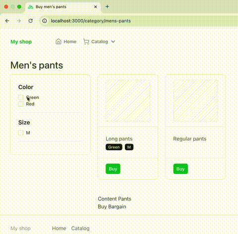
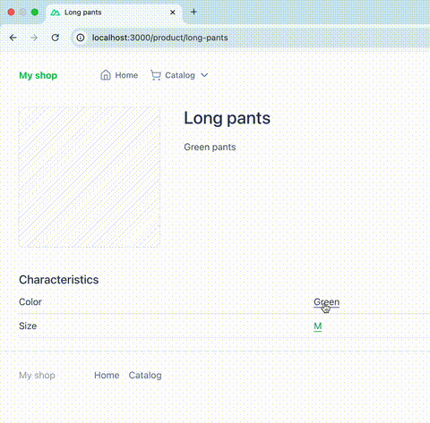

# Go Nuxt Seo filters 

*This code is only a small concept, possibly containing bugs, and is for reference only!*

## What is an SEO filter?

An SEO filter is a technology or tool on a website (most often in online stores) that allows 
you to automatically create landing pages (filter pages) based on combinations of filters 
(by price, brand, color, size, etc.) and optimize them for search queries.

Essentially, an SEO filter helps you to:

* Create a variety of unique pages for different search queries;
* Improve the visibility of the site in search engines;
* Attract additional traffic without manually generating a large number of pages.

### Example of SEO-filter operation

In a clothing store, the user selects:

Category: "Men's pants"

Color: "Green"

The site creates a dynamic page of the following form:
site.com/category/mens-pants/green-color

If this page is set up through an SEO filter, it will have:

* Its own CNC address (human-understandable URL);
* Meta tags (title, description) including keywords;

A unique title and SEO text (e.g. "Buy green pants - buy in the online store").

Visually, it looks like this:




### SEO filter pros

1. **Increased SEO traffic** - Each filter combination turns into a page that can rank in search.
2. **Increased relevance** - The user sees the exact result of their query - this reduces bounce rate and increases conversion.
3. **Saving time - Automatically** generating SEO pages instead of manual work.
4. **Improved website indexing** - Search engines get more useful content to index if everything is properly implemented.
5. **Flexibility** - You can promote both high-frequency queries (e.g., “Nike sneakers”) and low-frequency queries (e.g., “black winter Nike sneakers size 43”).

### It's important to consider

1. You should not index all possible combinations - only those that are actually searched for by users.
2. It is necessary to use canonical URLs, correct structure and unique texts - otherwise you can get filtered for duplicates.
3. Good implementation requires the cooperation of an SEO specialist and a developer.


Together with SEO-filtering you can use re-linking through characteristics (product attributes) for powerful reinforcement

## What is re-linking through characteristics?

This is creating links between filter pages based on specific product attributes such as brand, color, size, material, seasonality, etc.

Visually, it looks like this:



### Why do you need this kind of re-linking?

1. **Improved indexing** - Search engine robots find and index filter pages faster.
2. **Strengthening SEO** - Internal links with relevant anchors strengthen landing pages in the eyes of search engines.
3. **Growth of behavioral** factors - Users click on interesting features - browsing depth increases, bounce rate is less.
4. **Decrease in the number of “hanging” pages** - If the filtered page is not used anywhere and not re-linked, the search engine may not index it at all.

## Technical implementation

In this repository I tried to implement a small example of SEO filtering for an online store with server side on Go (Gin) and client on Nuxt.js.

### The implementation includes:

* Dynamic generation of CNC URLs based on selected filters;
* SEO settings (meta tags, titles, content);
* API endpoints for working with filters and getting data;
* Automatic re-linking by characteristics;

## Quick start

To start the server part, use:

```shell
docker-compose up --build
```

To start the client:

```shell
cd client && pnpm run dev
```

*Or via docker, Dockerfile is inside the client.*

The test data is located in the [seed folder](./seed).
